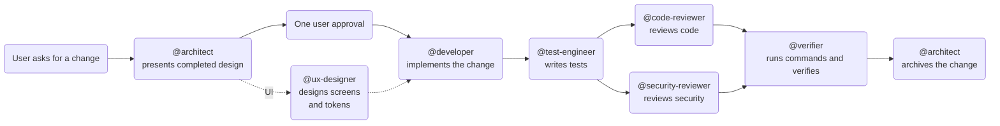

# OpenCode OpenSpec Multi-Agent

A multi-agent orchestrated development workflow built on [OpenSpec](https://openspec.dev).
The standard `@architect` run uses the full review and verification gates. Its
implementation and review pipeline starts at `@developer` after design approval.
   

## Features

- Spec-first: every change is grounded in an OpenSpec spec (proposal, design, tasks)
- Structured standard loop: architect → developer → test-engineer → parallel reviews → verifier → archive
- Agents: architect, developer, code-reviewer, security-reviewer, verifier,
  test-engineer, ux-designer, repo-scout, diff-summarizer
- Setup wizard: `npx openspec-multiagent init` or `node scripts/setup.mjs`
- Preflight checks for Node, OpenSpec CLI, Context7, and MCP servers

## What the agents do

| Agent | Responsibilities | Access allowed | Access denied | Mode |
|-------|-----------------|----------------|---------------|------|
| **@architect** | Plans and approves OpenSpec changes, directs the standard workflow, and archives. It never implements source changes; its prompt-level policy does not technically restrict shell use. | Edit `openspec/**`, `AGENTS.md`, `opencode/agents/*`; `shell *` (broad tool-level allow); subagent, skill, read, glob, grep, webfetch, websearch on `*` | Native edit outside the listed paths; prompt forbids implementing or mutating source code, but shell is not a sandbox | Primary (single-approval automatic workflow) |
| **@developer** | Implements OpenSpec changes following repo conventions; YAGNI; clean code; adds high-ROI tests; validates before reporting. | Edit `*`; shell `*`; subagent `repo-scout`, `diff-summarizer`; skill, read, glob, grep on `*` | None explicit (edit and shell on `*` are allowed) | Subagent |
| **@code-reviewer** | Reviews code against clean-code criteria (12 rules) and tests; approves or requests changes; never closes specs. | Git read-only (`status`, `diff`, `log`, `show`); `echo`, `ls`, `pwd`, `cat`; `openspec show/list`; test commands (`npm test`, `pytest`, `cargo test`, etc.); subagent `repo-scout`, `diff-summarizer`; skill, read, glob, grep on `*` | Edit `*`; shell `*` (denied except read-only commands listed) | Subagent |
| **@security-reviewer** | Evaluates code against 12 security criteria; tags findings CRITICAL/WARNING/SUGGESTION; never modifies code. | Git read-only; `echo`, `ls`, `pwd`, `cat`, `head`, `tail`, `wc`; `grep -rn *`; `openspec show/list`; subagent `repo-scout`; skill, read, glob, grep on `*` | Edit `*`; shell `*` (denied except read-only commands listed) | Subagent |
| **@verifier** | Independently verifies implemented changes by running real project commands; maps spec scenarios to PASS/FAIL/UNVERIFIABLE; never writes code. | Read-only shell: `echo`, `ls`, `pwd`, `cat`, `head`, `tail`, `wc`; git read-only; `openspec show/list/validate`; test commands (`npm test`, `pytest`, `go test`, etc.); build/lint/typecheck commands (`npm run build`, `tsc`, `eslint`, etc.); subagent `repo-scout`; skill, read, glob, grep on `*` | Edit `*`; shell `*` (denied except read-only commands listed; no mutations, deploys, or installs) | Subagent |
| **@test-engineer** | Writes unit and integration tests from OpenSpec scenarios; generates mocks and fixtures; follows repo test conventions. | Edit `*`; `echo`, `cat`, `ls`, `pwd`; `openspec show/list`; subagent `repo-scout`, `diff-summarizer`; skill, read, glob, grep on `*` | Shell `*` (denied except read-only commands listed) | Subagent |
| **@ux-designer** | Reviews UI/UX requirements; generates ASCII wireframes; specifies design tokens; component specs; accessibility checks. Never modifies code. | `echo`, `cat`, `ls`, `pwd`; `openspec show/list`; subagent `repo-scout`, `diff-summarizer`; skill, read, glob, grep on `*` | Edit `*`; shell `*` (denied except read-only commands listed) | Subagent |
| **@repo-scout** | Scans repository stack, conventions, and commands; read-only report; no files written. | `ls`; `git rev-parse`, `git ls-files`; `rg`; `cat`; read, glob, grep on `*` | Edit `*`; shell `*` (denied except read-only commands listed) | Subagent |
| **@diff-summarizer** | Produces terse, high-signal summary of git diffs; flags risk hotspots; no fixes, no style review. | Git read-only (`status`, `diff`, `log`); read, glob, grep on `*` | Edit `*`; shell `*` (denied except read-only git commands listed) | Subagent |

For the phase-by-phase workflow and each agent's triggers, outputs, and boundaries, see the [detailed agent workflow guide](docs/guides/agent-workflow.md).

Modes: **primary** = drives the change loop and may run read-only verification commands; **subagent** = dispatched by @architect with full context, independent session with no prior conversation history.

Standard full run (the implementation and review pipeline starts at `@developer`):


```mermaid
flowchart LR
    A("User asks for a change")
    B("@architect<br/>presents completed design")
    C("One user approval")
    D("@developer<br/>implements the change")
    E("@test-engineer<br/>writes tests")
    F("@code-reviewer<br/>reviews code")
    G("@security-reviewer<br/>reviews security")
    H("@verifier<br/>runs commands and verifies")
    I("@architect<br/>archives the change")

    A --> B
    B --> C --> D
    D --> E
    E --> F
    E --> G
    F --> H
    G --> H
    H --> I

    B -.-> |UI| U("@ux-designer<br/>designs screens<br/>and tokens")
    U -.-> D
```

`@architect` has a broad `shell *` permission at the OpenCode tool layer. Its
prompt instructs it not to implement or mutate source code, but that instruction
is not a technical shell sandbox. Every orchestrator run starts at `@developer`;
`@test-engineer` completes before `@code-reviewer` and `@security-reviewer` run
in parallel. The removed `--from` option is rejected. After correcting a failed
run, invoke `node scripts/orchestrate.mjs <change-name>` again to rerun all gates.

## Requirements

| Component | Minimum version | Why |
|---|---|---|
| Node.js | `>= 20.19.0` | Runs the setup scripts and OpenSpec CLI |
| `@fission-ai/openspec` | `>= 1.14.0` | Provides the `openspec-*` skills the agents load |
| `openspec-mcp` | any | MCP server exposing OpenSpec operations |
| Context7 | any | Up-to-date library/framework docs |
| OpenCode | V2 | Agent definitions and config use V2 shape |

> **Note:** Engram (project memory) and CodeGraph (code symbol graph) are optional components. They are not required for the OpenSpec multi-agent workflow to function.

## Quick start

Set up the workflow in two places:

1. **This repo** — the source of the workflow (scripts, agents, setup). Install and verify prerequisites here once.
2. **Your target project** — where your code lives and where you run the workflow. Install the agents there.

### Step 1: Install Node.js

Install [Node.js](https://nodejs.org) version 20.19.0 or newer:

```bash
node --version   # must be >= 20.19.0
```

### Step 2: Clone or download this repo

Get a copy of this repository:

```bash
git clone https://github.com/aortizsm/openspec-multiagent.git
cd openspec-multiagent
```

### Step 3: Verify prerequisites

From the repo root, run the setup wizard:

```bash
node scripts/setup.mjs
```

Equivalent, without referencing `scripts/` directly:

```bash
npm run setup
```

The wizard checks Node.js, installs the OpenSpec CLI, and configures the MCP servers and agent definitions.

### Step 4: Initialize your target project

In the project where you want to use the workflow — not in this repo — run:

```bash
npx openspec-multiagent init
```

Then start OpenCode in that directory and describe your change to `@architect`. @architect turns it into an OpenSpec spec and the change loop begins.

Daily commands (`setup`, `check`, `test`, `install-agents`, `reinstall`, `reset` and more) are listed in the [npm scripts](#npm-scripts) section below.

### Optional per-project model routing

The repository includes [`opencode.models.example.jsonc`](opencode.models.example.jsonc) as an **inactive** template. From this repository root, copy it into a target project using one recognized config filename:

```bash
cp opencode.models.example.jsonc /path/to/target-project/opencode.jsonc
# Or use the project's .opencode directory:
mkdir -p /path/to/target-project/.opencode
cp opencode.models.example.jsonc /path/to/target-project/.opencode/opencode.jsonc
```

The root `model` defaults new primary sessions (including `@architect`) to `opencode-go/mimo-v2.6-flash`; an already-selected session model remains in effect. The `agents` overrides assign MiMo to `developer`, `test-engineer`, `verifier`, `ux-designer`, `repo-scout`, and `diff-summarizer`, and `opencode-go/glm-5.3-flash` to `code-reviewer` and `security-reviewer`. These model-only overrides merge with installed agent definitions; they do not replace their prompts or permissions. `@architect` uses the primary session model, not a subagent override.

Connect OpenCode Go separately with `/connect`, then check `/models` for the configured IDs. Go usage limits are per model and vary by model; they are not one shared global spend cap. If enabled, Extra Usage may allow additional pay-as-you-go charges after included limits. The template does not enforce a spending cap. See the [agent workflow guide](docs/guides/agent-workflow.md) for details and current OpenCode references.

## Memory (Engram)

Engram is the project's persistent memory. It stores agreed decisions, flow rules, and change context so work can resume across sessions without repeating announcements or losing state.

- `mem_context` — recover current intent and open threads at session start
- `mem_save` — record decisions, rules, and checkpoint state
- `mem_search` — find past decisions before re-asking

Flow rules saved in Engram prevent announcement loops: execute first, announce later; one subagent at a time; stop and ask if repeating an action without executing it.

**Original project:** [Gentleman-Programming/engram](https://github.com/Gentleman-Programming/engram)

## npm scripts

| Script | What it does |
|---|---|
| `npm run setup` | Install/verify Node, OpenSpec CLI, Context7, and agents |
| `npm run check` | Preflight check (Node, OpenSpec, Context7, MCP servers) |
| `npm run test` | Run the project test suite |
| `npm run install-agents` | Copy agent definitions without touching OpenSpec |
| `npm run install-context7` | Configure only Context7 |
| `npm run install-engram` | Install/configure Engram local memory |
| `npm run reinstall` | Reinstall agents + MCP servers (overwrites existing) |
| `npm run reset` | Remove all multi-agent setup (destructive, requires `--confirm`) |

## License

MIT
